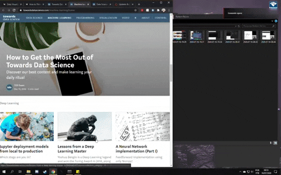

# Object tracking

_This is a simple program, created with python and opencv, to do different tasks on your computer just by moving an object around in front of the camera._

### Run this program with 
    python object_tracking.py

## Usage
For now the screen is divided in four areas and you can:
* Go to previous tab: move the object to left.
* Go to next tab: move the object to right.
* Scroll page up: move the object up.
* Scroll page down: move the object down.

If it's the first time you are executing this program, you need to click, using mouse left button, on the object placed in front of the camera and the program will get HSV color values of the object. If you are using the same object everytime, don't need to click to select HSV colors everytime because the program will store those values locally and will look for this file everytime the program start. However, if you want to select another object with different color, or if the lighting is not the same and you need to resample, can click anytime to select new HSV values.

Another use that can be easily implemented is to control medias like spotify, youtube or netflix by moving the object around the camera. Can just use appropriate functions inside the file "keyboard_movement_functions.py" and update the file "object_tracking.py".

This is a working in progress and my final idea is to perform tasks by hand gestures using neural networks. I think it will make a program more robust, because you won't need an object and will be able to perform lots of tasks with gestures.

## Next steps

### Things I want to do from here:
 * Add arguments on program start to select if I want to control a browser windows or multimedia sources.
 * Add an image recognition model to track the object without relying on its color only.
 * Create an interface to show everything in a pretty way.
 * Use the same idea to track head movement and use this to control camera in some simulator games I like to play such as Microsoft Flight Simulator and Elite: Dangerous.

## Other sources

### I got some functions and ideas from this sources:

* [Color picker](https://github.com/alieldinayman/HSV-Color-Picker)
* [Driving with motion recognition](https://github.com/TanayKarve/Driving-using-motion-recogniton)

Also, there is a lot of cool sources on stack overflow and opencv forum. 

